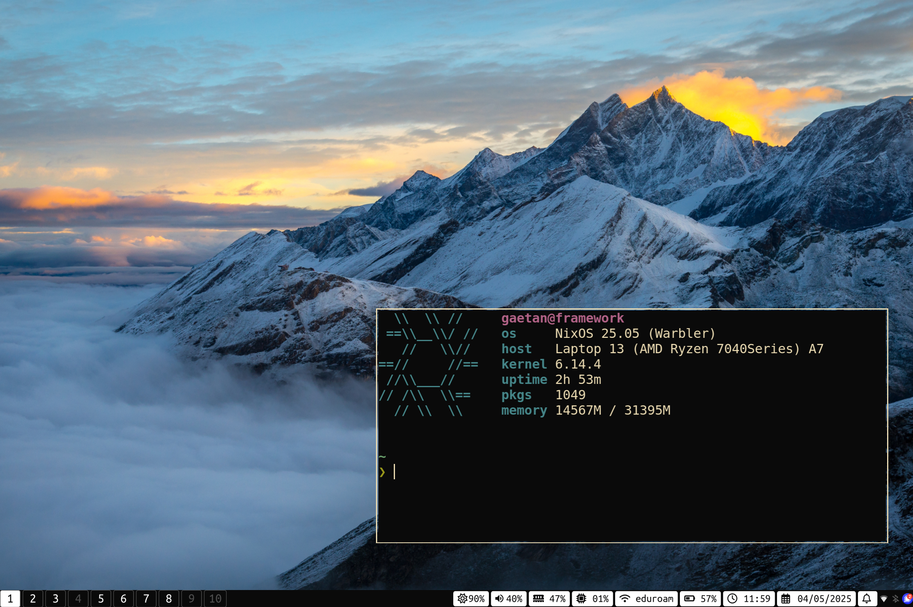

# ❄️ My NixOS Configuration

This repository holds the configuration for all my Linux systems.
It includes both my servers, my laptop and my desktop.


## Nix

I now manage all my configuration thanks to Nix.
Everything is managed thanks to a [nix flake](https://nixos.wiki/wiki/Flakes): `flake.nix`.
It relies heavily on the [Dendritic pattern](https://github.com/mightyiam/dendritic).
Each file is a [flake-parts](https://flake.parts) module.

### Repository structure

Everything is stored under the `modules/` folder and imported automatically thanks to [vic/import-tree](https://github.com/vic/import-tree).

```
├── flake.nix       # Entry-point of the flake
├── modules/
│   ├── flake/      # flake modules
│   ├── home/       # shared home-manager modules
│   ├── hosts/      # declaration of the NixOS/HM hosts
│   └── nixos/      # shared nixos modules
└── .secrets        # (age encrypted) secrets for each system
```

## Systems

| Hostname      | NixOS?    | Comment                           |
| :------------ | :-------- | :-------------------------------- |
| `framework`   | Yes       | Laptop                            |
| `cuda`        | Yes       | Personal workstation              |
| `paris`       | Yes       | Linux x86 builder                 |
| `vps`         | Yes       | VPS (VPN, mail server, etc.)      |
| `tank`        | Yes       | NAS (ZFS, Nextcloud, etc.)        |
| `feroe`       | Yes       | Backup (replication of `tank`)    |

### Linux working environment



Here are the programs I use on my working systems.
I keep my configuration minimal and efficient.

| Program               | Name                                                  |
| :-------------------- | :-----------------------------------------------------|
| Linux Distribution    | [NixOS](https://nixos.org/)                           |
| Web Browser           | [Firefox](https://www.mozilla.org/en-US/firefox/new/) |
| Window Manager        | [sway](https://swaywm.org/)                           |
| Bar                   | [waybar](https://github.com/Alexays/Waybar)           |
| Terminal Emulator     | [foot](https://codeberg.org/dnkl/foot)                |
| Code Editor           | [Neovim](https://neovim.io/)                          |
| Program Launcher      | [rofi](https://github.com/DaveDavenport/rofi)         |
| Shell                 | [fish](https://fishshell.com/)                        |
| PDF viewer            | [Zathura](https://pwmt.org/projects/zathura/)         |


## Acknowledgements

Thanks to [@mightyiam](https://github.com/mightyiam) and [@drupol](https://github.com/drupol) for helping me migrating my configuration to the dendritic pattern.
